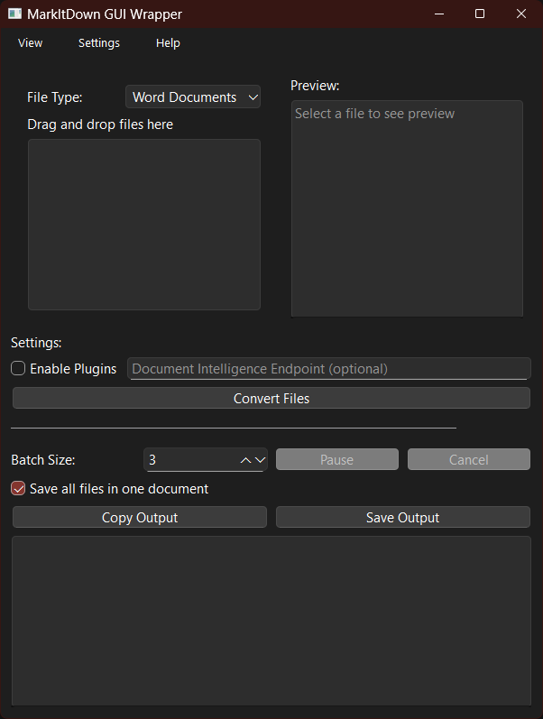

[阅读中文版本](README_zh.md)

# MarkItDown GUI Wrapper

A feature-rich **GUI wrapper** for `MarkItDown`, built with **PySide6**. Easily convert files to markdown using drag & drop.



## Features

- 📂 **File Management**:
  - Drag & Drop for batch processing
  - File type filtering
  - Recent files history
  - Batch processing with pause/resume
  
- 🎨 **User Interface**:
  - Dark/Light theme support
  - Preview panel
  - Progress tracking
  - Keyboard shortcuts
  
- ⚙️ **Advanced Options**:
  - Format customization (headers, tables)
  - Auto-save and backup
  - Enable plugins
  - Document Intelligence API support
  
- 🛠️ **Output Options**:
  - Save all in one file or separately
  - Choose output directory
  - Quick copy & paste
  - Preview before saving

## Installation

You can download the precompiled executable from the [Releases](https://github.com/imadreamerboy/markitdown-gui/releases) or build it from source. For that just follow the instructions below.

### Prerequisites

- Python **3.10+**
- Install dependencies:

```sh
pip install -r requirements.txt
```

### Run the App

```sh
python -m markitdowngui.main
```

### Keyboard Shortcuts

- `Ctrl+O`: Open Files
- `Ctrl+S`: Save Output
- `Ctrl+C`: Copy Output
- `Ctrl+P`: Pause/Resume
- `Ctrl+B`: Begin Conversion
- `Ctrl+L`: Clear List
- `Ctrl+K`: Show Shortcuts
- `Esc`: Cancel Conversion

## Build a Standalone Executable

Use `PyInstaller`:

```sh
pyinstaller --clean --onefile --windowed -n MarkItDown markitdowngui/main.py
```

## License

Licensed under **MIT**.

**Note:** `PySide6` uses **LGPLv3**, requiring dynamic linking.

## Contributing

Contributions welcome! Fork, open issues, or submit PRs.

## Credits

- **MarkItDown** ([MIT License](https://opensource.org/licenses/MIT))
- **PySide6** ([LGPLv3 License](https://www.gnu.org/licenses/lgpl-3.0.html))


