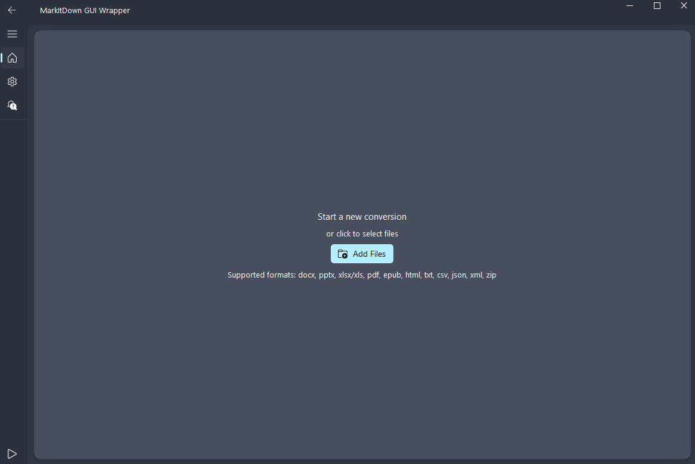

# MarkItDown GUI 封装

一个功能丰富的 **GUI 封装**，用于 `MarkItDown`，使用 **PySide6** 构建。通过拖放轻松将文件转换为 markdown。


## 特性

- 📂 **文件管理**:
  - 拖放以进行批量处理
  - 文件类型过滤
  - 最近文件历史记录
  - 批量处理，支持暂停/恢复
  
- 🎨 **用户界面**:
  - 深色/浅色主题支持
  - 预览面板
  - 进度跟踪
  - 键盘快捷键
  
- ⚙️ **高级选项**:
  - 格式自定义（标题、表格）
  - 自动保存和备份
  - 启用插件
  - 文档智能 API 支持
  
- 🛠️ **输出选项**:
  - 全部保存在一个文件中或单独保存
  - 选择输出目录
  - 快速复制和粘贴
  - 保存前预览

## 安装

您可以从 [Releases](https://github.com/imadreamerboy/markitdown-gui/releases) 下载预编译的可执行文件，或从源代码构建。为此，只需按照以下说明操作。

### 先决条件

- Python **3.10+**
- 安装依赖项：

```sh
pip install -r requirements.txt
```

### 运行应用程序

```sh
python -m markitdowngui.main
```

### 键盘快捷键

- `Ctrl+O`: 打开文件
- `Ctrl+S`: 保存输出
- `Ctrl+C`: 复制输出
- `Ctrl+P`: 暂停/恢复
- `Ctrl+B`: 开始转换
- `Ctrl+L`: 清空列表
- `Ctrl+K`: 显示快捷键
- `Esc`: 取消转换

## 构建独立可执行文件

使用 `PyInstaller`：

```sh
pyinstaller --clean --onefile --windowed -n MarkItDown markitdowngui/main.py
```

## 许可证

根据 **MIT** 许可证授权。

**注意：** `PySide6` 使用 **LGPLv3**，需要动态链接。

## 贡献

欢迎贡献！请按照以下步骤进行贡献：

1.  **Fork 本仓库**并为您的功能或错误修复创建一个新分支。
2.  **设置开发环境**：
    *   建议使用虚拟环境。
    *   本项目使用 `uv` 进行包管理。
    *   要安装所有依赖项（包括开发和测试依赖项），请运行：
      ```sh
      uv pip install -e .[dev]
      ```
3.  **进行更改**。
4.  **运行测试**以确保一切正常：
    ```sh
    pytest
    ```
5.  **提交拉取请求**并清楚地描述您的更改。

## 鸣谢

- **MarkItDown** ([MIT 许可证](https://opensource.org/licenses/MIT))
- **PySide6** ([LGPLv3 许可证](https://www.gnu.org/licenses/lgpl-3.0.html))
