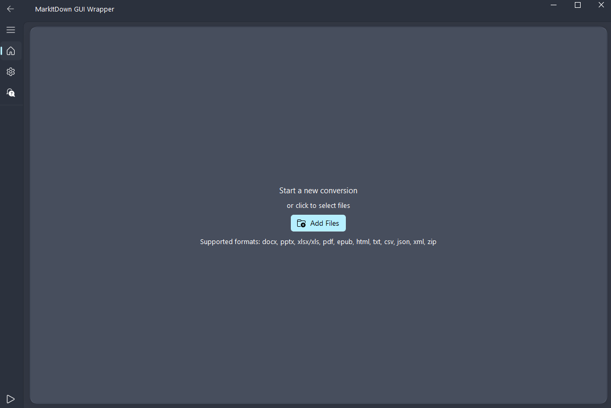

# MarkItDown GUI 封装

这是一个基于 `PySide6` 和 `QFluentWidgets` 的 `MarkItDown` 桌面 GUI。
目标是用更直观的界面完成多文件到 Markdown 的转换。



## 功能

- 基于队列的文件流程，支持拖放添加文件。
- 批量转换，支持开始、暂停/恢复、取消和进度反馈。
- 结果页支持按文件查看转换结果。
- 预览模式支持渲染视图和原始 Markdown 视图。
- 保存模式支持合并为单文件或分别保存多个文件。
- 常用操作：复制 Markdown、保存输出、返回队列、重新开始。
- 可选 OCR，支持扫描版 PDF 和图片文件，优先使用 Azure Document Intelligence，不可用时回退到本地 Tesseract。
- 设置项包括输出目录、批处理大小、标题样式、表格样式、OCR 和主题模式（浅色/深色/跟随系统）。
- 内置快捷键面板、检查更新入口和关于对话框。

## 安装

你可以从 [Releases](https://github.com/imadreamerboy/markitdown-gui/releases) 下载预编译版本，或从源码运行。

### 前置要求

- Python `3.10+`
- 推荐使用 `uv`

安装依赖：

```sh
uv sync
```

也可以：

```sh
pip install -e .[dev]
```

### OCR 说明

- OCR 为可选功能，默认关闭。
- 本地 OCR 需要系统已安装 `tesseract`。如果它不在 `PATH` 中，可以在设置页里指定可执行文件路径。
- Azure OCR 需要在设置页里填写 Azure Document Intelligence 终结点。
- 若使用 API Key 认证，请设置 `AZURE_API_KEY` 环境变量。
- 如果未设置 `AZURE_API_KEY`，Azure OCR 会回退到 `DefaultAzureCredential` 支持的 Azure 身份凭据。

## 运行应用

```sh
uv run python -m markitdowngui.main
```

## 键盘快捷键

- `Ctrl+O`: 打开文件
- `Ctrl+S`: 保存输出
- `Ctrl+C`: 复制输出
- `Ctrl+P`: 暂停/恢复
- `Ctrl+B`: 开始转换
- `Ctrl+L`: 清空队列
- `Ctrl+K`: 显示快捷键
- `Esc`: 取消转换

## 构建独立可执行文件

```sh
uv pip install -e .[dev]
pyinstaller MarkItDown.spec --clean --noconfirm
```

默认会生成 `onedir` 结构，输出目录为 `dist/MarkItDown/`。
发布工作流会将该目录打包为按平台区分的 `.zip` 制品。

## 许可证

本项目采用 **GPLv3（仅限非商业用途）**。

商业用途需要单独的商业授权。
该策略与 `PySide6-Fluent-Widgets`（`qfluentwidgets`）的非商业许可要求保持一致。

## 贡献

1. Fork 仓库并创建分支。
2. 安装开发依赖：

```sh
uv pip install -e .[dev]
```

3. 提交代码修改。
4. 运行测试：

```sh
uv run pytest -q
```

5. 提交 PR，并清楚说明变更内容。

## 鸣谢

- MarkItDown ([MIT 许可证](https://opensource.org/licenses/MIT))
- PySide6 ([LGPLv3 许可证](https://www.gnu.org/licenses/lgpl-3.0.html))
- PySide6-Fluent-Widgets / QFluentWidgets ([项目主页](https://qfluentwidgets.com))
